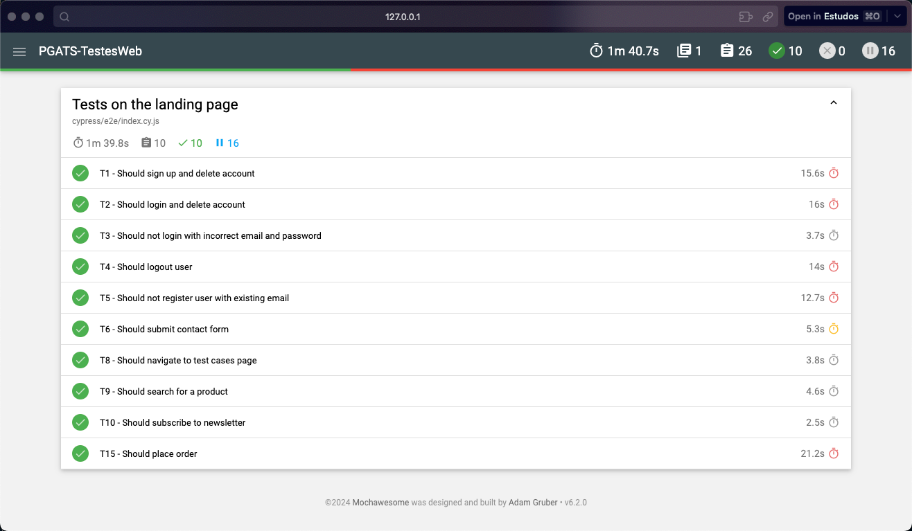
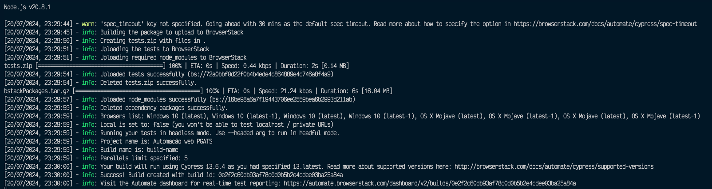
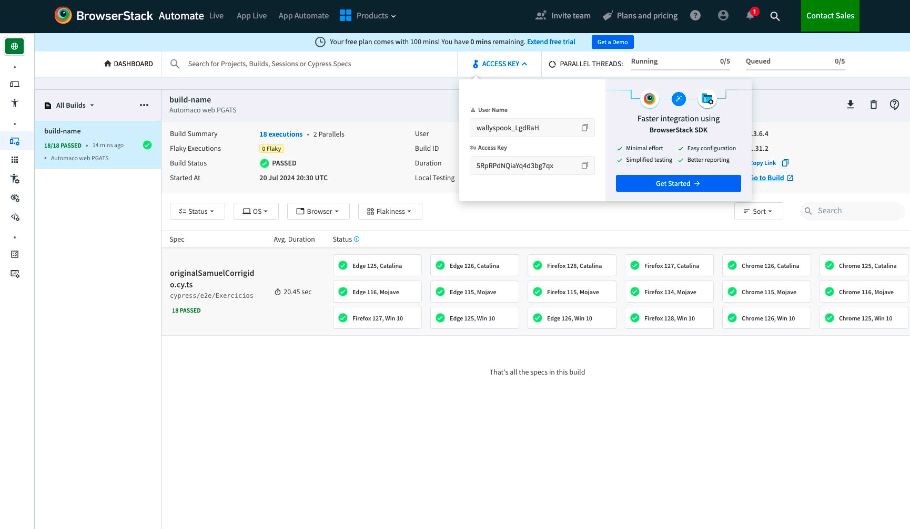

```sh {"id":"01J39HW9C8T6TYWR6JBNGF0P2Y"}
Projeto de teste WEB para a disciplina de Testes WEB do professor Samuel

## Instalação

```npm install```

## Execução
Modo open:
```npm run cypress:open```

Modo headless:
```npm run cypress:run```

Report gerado em:
```cypress/reports/html/index.html```



Modo cloud:
```npm run browserstack:run```

Report gerado em:
```cypress/reports/html/index.html```




```